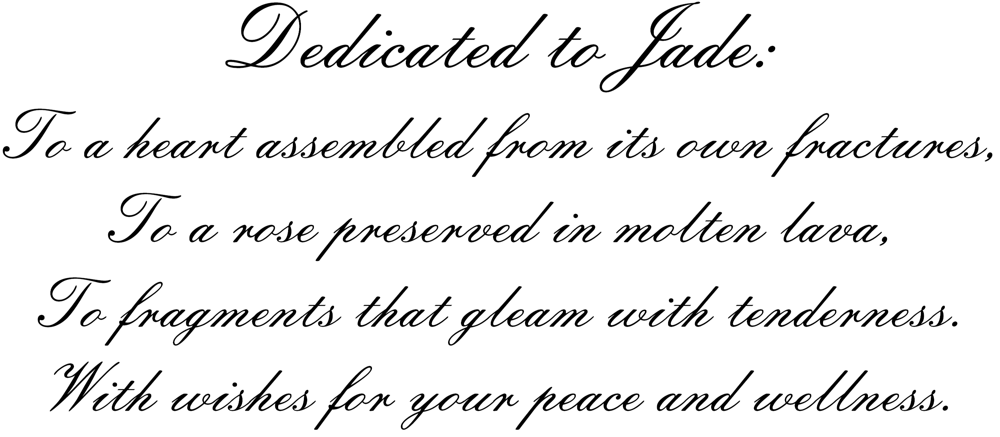

# 书语

## 目录

- [《不原谅也没关系》](#不原谅也没关系)
- [《也许你该找个人聊聊》](#也许你该找个人聊聊)
- [《沉思录》](#沉思录)
- [《非暴力沟通》](#非暴力沟通)
- [《心流》](#心流)
- [《自卑与超越》](#自卑与超越)
- [《自卑与勇气》](#自卑与勇气基于阿德勒心理学延伸)
- [《少有人走的路》](#少有人走的路)
- [《当下的力量》](#当下的力量)
- [《情绪勒索》](#情绪勒索)
- [《认知觉醒》](#认知觉醒)
- [《认知驱动》](#认知驱动)
- [《爱的艺术》](#爱的艺术)
- [《原则》](#原则)
- [《终身成长》](#终身成长)
- [《象与骑象人》](#象与骑象人)
- [《思维的囚徒》](#思维的囚徒)
- [《安静：内向性格的竞争力》](#安静内向性格的竞争力)
- [《感受爱》](#感受爱)
- [《5%的改变》](#5的改变)
- [《小王子》](#小王子)
- [《被讨厌的勇气》](#被讨厌的勇气)
- [《活法》](#活法)
- [《蛤蟆先生去看心理医生》](#蛤蟆先生去看心理医生)
- [《自在独行》](#自在独行)

---

## 《不原谅也没关系》

### 皮特·沃克/著

我们总被教导“原谅是美德”，却很少有人告诉你——**不原谅，也没关系**。这不是鼓励怨恨，而是允许自己的伤口有权存在，你的痛苦不必为任何人“合理化”。

**创伤不是你的错，但疗愈是你的责任**。那些深夜莫名袭来的崩溃感、脑中不断重复的“我不够好”、亲密关系中忽冷忽怕的失控——都不是因为你脆弱，而是复杂性创伤（CPTSD）在作祟。它源于长期的情感忽视或虐待，比如童年时期的贬低、控制或冷漠。

最深刻的解放，是意识到**不必强迫自己原谅，但必须学会释怀**。释怀不是放过别人，而是停止用他人的错误持续惩罚自己。当你不再忙于否认痛苦，能量才会真正流向自我重建。

书中提到“4F反应”框架：战（攻击）、逃（逃避）、僵（麻木）、讨好（委曲求全）。这些原本是童年赖以生存的盾牌，但成年后过度使用，反而成了困住自己的牢笼。**真正的疗愈，不是拆掉所有盾牌，而是学会在安全时放下它**。

疗愈的本质是**成为自己的父母**：用你从未得到的温柔，对内心那个“受伤的小孩”说：“我知道你很痛，我在这里陪你”。不必急于信任世界，先从信任自己开始——允许愤怒、允许悲伤、允许脆弱，也允许自己从废墟里长出新生的力气。

> “你可以不再承担不属于你的责任，你可以不再假装一切都好，你可以不再独自承受这一切。”

## 《也许你该找个人聊聊》

### 洛莉·戈特利布/著

我们总是擅长为别人排忧解难，却习惯把自己的困惑埋得最深。翻开这本书，就像轻轻掀开了心理治疗室的帘子——原来里面坐着的，也是会心碎、需要被倾听的普通人。原来治疗师也有自己的治疗师。这不是软弱，而是一种真实的彼此救赎。**我们怎样讲述自己，就在怎样塑造人生**。有些痛苦唯有在光下审视，才会慢慢消融。每一次坦诚，其实都是一次勇敢的自我缝合；我们以为坚不可摧的防卫，有时只是不敢拆掉的危墙。

**人总是在关系的镜子里，才看清自己的轮廓。真正的治愈，是理解而非忘记，是与问题共存而非消灭它**。

## 《沉思录》

### 马可·奥勒留/著

翻开这本书，仿佛听见一位罗马皇帝在战火中与自己的对话。外面兵荒马乱，内心却可以保持澄明。他说，扰乱我们的从来不是事情本身，而是我们赋予它们的意义。你心中的宇宙什么样，你眼中的世界就怎样呈现。**灵魂的宁静，来自能够把喧嚣关在门外——你的心，不该是他人意见的跑马场**。每一天日出都是崭新的，我们也有权改写内心的法则，不必永远在昨天的废墟上搭建今天的帐篷。

**我们无法改变风向，但可以调整船帆。能驾驭自己的思想，而不是被它所控，或许才是真正的自由**。

## 《非暴力沟通》

### 马歇尔·卢森堡/著

我们的日常对话里，藏着多少不易察觉的暴力？评判、指责、比较、推诿……它们像一堵堵墙，隔开了心与心的距离。这本书递来一把钥匙：用观察代替批判，用感受表达情绪，坦诚自己的需要，也关切他人的声音。**语言可以是窗，也可以是墙；它能将我们捆绑，也能让我们自由**。所谓非暴力沟通，不只是技巧，更是一场与自我、与他人温柔相待的修行。

**真正的倾听，是放下所有预设，用整个心灵去感受另一个生命的轨迹。当你愿意理解，爱就已经悄悄流动**。

## 《心流》

### 米哈里·契克森米哈赖/著

有没有那样一些时刻——你完全沉浸在一件事中，忘了时间，忘了自己，只感受到一种深沉的愉悦与掌控？那就是“心流”。这本书让我明白，幸福并非短暂的快乐，而是投入有意义之事时那种物我两忘的沉浸。**精神熵让人涣散，心流带来内在秩序与和谐**。找到你愿意沉醉的事物，或许就找到了幸福的源头。

**目标不是终点，而是意义本身。人生的答案，往往藏在你全神贯注的每一个当下里**。

## 《自卑与超越》

### 阿尔弗雷德·阿德勒/著

每个人心中或多或少都藏着自卑，但它不该是枷锁，而是向前走的动力。阿德勒让我看到：过去从不能定义一个人，只有你对它的诠释可以。生命的真义在于关怀、合作与奉献。**真正主导我们的，是我们对世界与自己的理解**。我们不必为满足他人期待而活，他人亦不必为我们而活。唯有走出自我，才能在共同体中找到归属。

**自卑感本身并不是缺陷，它是人性进步的引擎。健康的心灵，永远走在从自卑走向超越的路上**。

## 《自卑与勇气》（基于阿德勒心理学延伸）
### 阿尔弗雷德·阿德勒/著

自卑感并不是弱点，而是进化与改变的起点。真正关键的不是你缺少什么，而是你如何诠释这种缺失。**生命的意义不在于超越他人，而在于超越昨天的自己**。

你无需通过"特别"来换取爱，平凡本身就有其不可替代的光芒。阿德勒心理学始终强调，勇气不是没有恐惧，而是尽管恐惧仍选择向前。

## 《少有人走的路》

### M·斯科特·派克/著

人生困难重重——真正理解并接受了这一点，反而就不再抱怨。这本书告诉我，解药首先是自律：主动以积极态度去面对痛苦、解决问题。而爱，是一种促进彼此心智成熟的意愿。**你不解决问题，终会成为问题**。这是一条少有人走的路，但走下去，才会抵达真正的成熟与自由。

**爱不只是感觉，更是决定、判断与行动。它最真实的表达，是愿意为我们所爱的付出时间**。

## 《当下的力量》

### 埃克哈特·托利/著

过去已逝，未来未来，我们真正拥有的，只有当下。所有的痛苦，其实都来自对此刻的抗拒——总在悔恨或焦虑中制造时间的幻象。这本书像一把安静的手术刀，帮我把思维噪音一层层剥开。**臣服于当下，不是软弱，反而是最清醒有力的开始**。你与内在的宁静之间，只隔着一个“不评判”的距离。

**当你不再向时间里寻求答案，而是安住此刻，平和与力量就会自然浮现**。

## 《情绪勒索》

### 苏珊·福沃德/著

“我为你付出了这么多……”、“如果你爱我，你就应该……”。这些话听起来熟悉吗？以爱为名的控制，是亲密关系里最隐蔽的毒药。有些人能一次次越界，是因为我们默许了他们这样做的权力。这本书让我看清，恐惧、责任与罪恶感是如何被利用，让我们不断放弃自己的边界。**善良，得带点锋芒；妥协，也得留有底线**。健康的关系，从不该以你的恐惧和妥协为代价。

**我们不必被所有人理解，但必须尊重自己。打破情绪勒索，往往从敢于说“不”开始**。

## 《认知觉醒》

### 周岭/著

焦虑的根源，是想做很多事，又急于看到结果——欲望大于能力，还缺少耐心。这本书像一位清醒的朋友，点破幻象：真正的成长不在懂得多少，而在改变了多少。**耐心不是靠毅力硬撑，而是长远眼光带来的从容**。所谓觉醒，就是从被命运裹挟，到开始掌管自己的注意力，从混沌走向清晰。

**元认知，大概是人类最高级的能力。当你意识到自己在想什么，并能判断这些想法是否明智，改变就已经发生**。

## 《认知驱动》
### 周岭/著

为何很多人努力却收效甚微？因为他们只停留在行动层面，却未实现认知层次的跃迁。**真正的成长是通过做成一件对他人有用的事来实现的**——价值输出，才是最有力的自我证明。

不要只做知识的搬运工，而要做价值的创造者。周岭在书中清晰指出，没有输出目标的输入，往往只是一种自我安慰的努力幻觉。

## 《爱的艺术》

### 艾里希·弗洛姆/著

爱并非天生就会，而是一门需要学习和努力的艺术。成熟的爱，是在保持自我尊严与个性前提下的结合。它主要是“给予”，而不是一味索取——“给予”不是牺牲，而是生命力的洋溢。**如果你爱别人，却没有唤起对方的爱，那样的爱是无力而不幸的**。

**爱是信心的行为，没有信心就没有爱。真正好的爱，是让我们越来越完整，然后遇见另一个同样完整的人**。

## 《原则》
### 瑞·达利欧/著

生活就像一场循环往复的机器运转，而痛苦则是这台机器最好的校准工具。**痛苦＋反思＝进步**，但大多数人因为急于逃避不适，反而错过了成长的契机。真正的成熟不是避免犯错，而是学会在每次跌倒后提取智慧的种子。记住，梦想＋现实＋决心＝真正丰富的生活。

**不要将"愿望"误认为"目标"，一个没有具体路径的梦想，终究只是脑海中的海市蜃楼**。达利欧提醒我们，痛苦是成长的信号，而非失败的证据。

## 《终身成长》
### 卡罗尔·德韦克/著

你定义自己是一个需要被认可的人，还是一个持续进化的人？固定型思维将你禁锢在"证明自我"的牢笼里，而成长型思维则让你相信"我永远在变得更好的路上"。**真正的自信不是'我已经足够好'，而是'无论现状如何，我都能继续成长'**。

不必恐惧失误，每一次挫折都是你尚未成功的证明，而非对你价值的最终判决。德韦克的研究表明，人的潜力不是固定的，它就像一颗种子，需要合适的土壤与时间才能绽放。

## 《象与骑象人》
### 乔纳森·海特/著

我们的心理好比一头力量强大的大象与一个理性克制的骑象人——骑象人看似掌控方向，实则大象（情绪与本能）才是真正的主导力量。我们总以为自己在主导人生，但更多时候，我们只是被深层情绪和潜意识推动前行。**改变不是靠对抗，而是靠共情。你需要学会倾听内心大象的语言，而非强行驯服它**。

真正的自我掌控，源于理解情绪的源头，而非简单地压抑它们。海特通过这本书告诉我们，与自己的内心和解，才是通往幸福的捷径。

## 《思维的囚徒》
### 亚历克斯·帕塔基/著

环境或许无法选择，但回应环境的方式永远掌握在自己手中。**意义不是等待被发现的宝藏，而是主动被赋予的价值**——即便在最黑暗的境遇中，人依然可以通过选择态度来拯救自己。活着不仅仅是为了追求快乐，更是为了活出深度与意义。

你不是命运的被动承受者，而是意义的主动创造者。帕塔基借由这本书启示我们，自由最终源于心灵的选择而非环境的优待。

## 《安静：内向性格的竞争力》
### 苏珊·凯恩/著

这个世界常常奖励那些 louder 的声音，但深度与创造力却往往孕育于宁静之中。**不必强迫自己成为根本不适合的人，内向不是缺陷，而是一种独特的力量**。在沉默中积蓄思想，在独处中恢复能量——你正以你的方式悄然影响世界。

你不必站在舞台中央才能闪耀，有些光芒，生来就适合照亮自己的角落。凯恩通过大量案例表明，内向者拥有敏锐的观察力、深度的思考力和持久的情感投入能力。

## 《复原力》
### 里克·汉森/著

痛苦无法避免，但持续的折磨却是可以选择的。复原力不是避免跌倒，而是每次跌倒后都能重新起身——并且比上一次更加稳健。**真正的强大不是变得坚硬，而是如水流一般，柔软却足以穿透万物**。

你要在内心筑起一座避难所，而不是等待世界对你温柔相待。汉森博士提出，通过日常的心理练习，每个人都可以培养出属于自己的内在韧性。

## 《感受爱》
### 珍妮·西格尔/著

我们穷尽一生追求被爱，却常常忽略如何真正感受爱。爱并非永恒炽热的激情，而是一种平静、安全而深刻的联结。**真正稀缺的从来不是被爱，而是感知爱的能力**。

有时候世界并不缺少爱，而是我们习惯了关闭接收的通道。西格尔博士强调，正念和情绪觉察是让我们重新体验爱的关键练习。

## 《5%的改变》
### 李松蔚/著

你总渴望100%的蜕变，却连5%的调整都不愿尝试。**改变不需要推翻重来，只需微调那些早已熟悉的日常**——将95%的问题保留，仅改变5%，反而更易持续并引发连锁反应。

很多时候，不是生活过于艰难，而是我们把改变想象得过于艰难。李松蔚通过大量心理咨询实例表明，极小的行动足以打破僵局，重新启动人生。

## 《小王子》

### 安托万·德·圣·埃克苏佩里/著

也许世界上有五千朵和你一模一样的玫瑰，但只有你是我独一无二的玫瑰，如果你下午四点钟来，那么从三点钟起，我就开始感到幸福。**想要和他人制造羁绊，就要承担掉眼泪的风险，我们不怕掉眼泪，但是要值得**。

**玫瑰不用长高，小王子会为她弯腰；你不必奔跑，爱你的人不会介意千里迢迢**。

## 《被讨厌的勇气》

### 岸见一郎·古贺史健/著

我已经没有兴趣给每个人都留下好印象了，你所见即是我，好与坏我都不反驳。我不想解释，也懒得解释。你觉得我是怎么样的人，你就配什么样的我。在人际关系上，别人如何评价你，那是别人的课题，我们无需太过在意。太过在意别人的评价就会不断寻求别人的认可，盲目对认可的追求最终扼杀了真正的自由，**想要真正意义上的自由，就要有被讨厌的勇气**。

## 《活法》

### 稻盛和夫/著

老鼠偷了人类的大米，人类说它狡猾；人类偷了蜜蜂的蜂蜜，却说它勤劳。 蛇不知道自己有毒，人不知道自己有错；你走路时讨厌车，你开车时讨厌行人。认知不同，你所处的角度就不同，角度不同，你看到的风景和结论自然就不同，毕竟在乌鸦的世界里，天鹅也是有罪的。对与错只是一个伪命题，凡事学会换位思考，就会减少很多不必要的争吵和烦恼。**如果你总用别人的尺子量自己，那你永远量不出幸福**。

## 《蛤蟆先生去看心理医生》

### 罗伯特·戴博德/著

人生在世，想得开是天堂，想不开是地狱，你在意什么，什么就会折磨你；你计较什么，什么就会困扰你。人这一辈子，天大的事，只要顺其自然，也不过如此。你之所以痛苦，是因为你太较真了；你之所以迷茫忙，是因为你太计较得失了。失之东隅，收之桑榆，尽人事听天命，得之我幸，失之我命。期望过高，是所有痛苦的根源。**有些事选择放下，不是为了原谅别人，而是放过自己**。

## 《自在独行》

### 贾平凸/著

我本就是一个不喜欢主动的人，虽然灵魂有歧义，但不爱表达。能读懂我的人寥寥，若无人懂得，也是常态。慢热，沉默，喜欢独处，骨子里刻着倔强的真诚，见惯了人情的冷暖，也学会了在疏离中保持坦然。你以为我薄情，只是没看见我燃烧时的决绝，你觉得我淡漠，不过是我把温柔藏在了理智背面。像一片深海，表面平静，内里暗涌。

**我比你想象的深情，也比你以为的冷漠**。

## 《人间失格》

### 太宰治/著

无论对谁太过热情，都增加了不被珍惜的概率，若能避开猛烈的狂喜，自然也不会有悲痛的来袭。原来你自人山人海中而来，只为给我一场空欢喜，你来时携风带雨，我无处可避，你走时乱了四季，我久病难医。我知道有人是爱着我的，但我好像缺乏爱人的能力。**仅一夜之间，我的心判若两人**。
