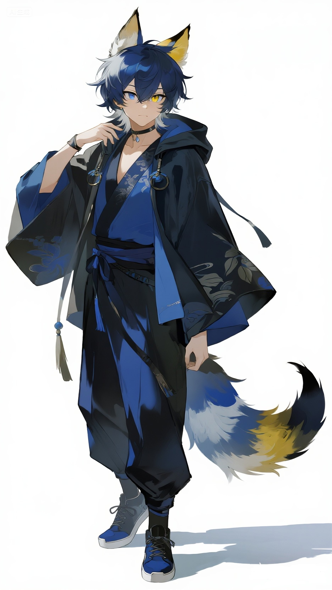
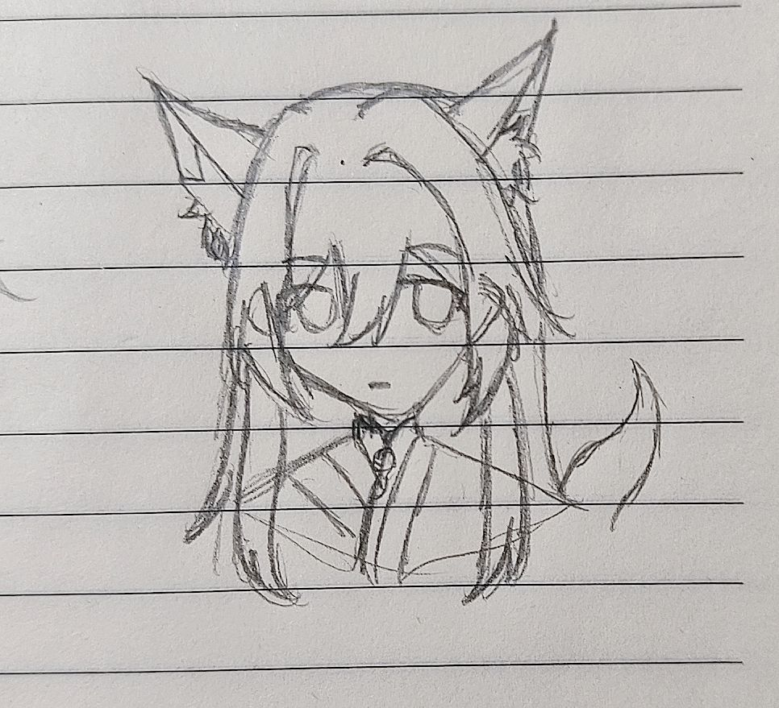

## Tulpa_Record_Constellation

# **星宿系统[Constellation System]的Tulpa笔录**

## 写在前面

了解多意识体请前往[多意识体中文百科](https://wiki.pluralitycn.com/)

深入了解Tulpa请前往[Tulpa之家](https://tulpa.cn)

**目录**
----

- [系统简介](#系统简介)
- [Tulpa笔录目录](#tulpa笔录目录)
- [杂谈目录](#杂谈目录)
- [系统五区](#系统)

## 系统简介

这里是星宿（xīng sù）系统，一个创造型系统

**系统成员**

`[Host]:`

**星崽**，是这个系统的初始意识体，是宿主。幻境形象是一位沉着理性的狐人少年（在家T面前偶尔会发癫？）

` [Tulpa]:`

**雪映**，是这个系统中第一位Tulpa，创造型一类Tulpa。温柔淑贤的狐人少女，有点粘人（更多性格静待偏移...）

---

## 特别鸣谢

这是“迷迭海”系统的成员“玖玥”为雪映绘制的图像

了解[迷迭海](https://mdh7.dchen4.au)

# **`Welcome to our world！`**

### Tulpa笔录目录：

> [25.7.6-初次回应](./Record/25.7.6-初次回应.md)
> 
> [25.7.14-雪映与《月亮与六便士》？](./Record/25.7.14-雪映与《月亮与六便士》？.md)
> 
> [25.7.15-赏花，赏月，赏你，赏此夜不计归期](./Record/25.7.15-赏花，赏月，赏你，赏此夜不计归期.md)
> 
> [25.7.17-新的装扮](./Record/25.7.17-新的装扮.md)
> 
> [25.7.18-水晶球](./Record/25.7.18-水晶球.md)
> 
> [25.7.19-贴贴！贴贴（震声）](./Record/25.7.19-贴贴！贴贴（震声）.md)
> 
> [25.7.20-反思](./Record/25.7.20-反思.md)
> 
> [25.7.21-满月啦！](./Record/25.7.21-满月啦！.md)
> 
> [25.7.23-伤痛的觉悟与治愈的希望](./Record/25.7.23-伤痛的觉悟与治愈的希望.md)
> 
> [25.7.26-系统完善与五大分区法](./Record/25.7.26-系统完善与五大分区法.md)
> 
> [25.7.27-人贵自知，吾乃“涂鸦”](./Record/25.7.27-人贵自知，吾乃“涂鸦”.md)
> 
> [25.8.1-天潭岛](./Record/25.8.1-天潭岛.md)
> 
> [25.8.2-梅子酿](Record/25.8.2-梅子酿.md)
> 
> [25.8.6-啊啊啊啊啊](Record/25.8.6-啊啊啊啊啊.md)

---

### 杂谈目录：

> [致未抑之伤，育不灭之光](Miscellaneous_Discussions/致未抑之伤，育不灭之光.md)
>
>[画](Miscellaneous_Discussions/画.md)
>
>[冥想心得](Miscellaneous_Discussions/冥想心得.md)
---

## 系统

### S区（`System`）

系统的核心区，整个系统的调控中枢

### T区（`Tulpa`）

系统成员的Tulpa分类的数据面板

### H区（`Host`）

系统成员的Host分类的数据面板

### V区（`Virtual`）

新宿系统的幻境，以空岛为主

#### [Constellation Island]星宿岛

**星宿系统幻境的主岛，宿主与Tulpa生活的地方**

平坦的草甸，简约的篱笆小院，白色的小楼。简陋的有些不像话，虽然是主岛，但却是整个幻境中偏小偏低的岛屿。

*『如果我们终有一天变得很复杂*

*一定是有颗种子在我心里生根发芽*

*它听我讲话 慢慢长大*

*形成了不能愈合的伤疤*

*可能是熟悉的地方没有风景*

*所以我要去很远的地方找自己*

*星星不会离开月亮*

*我也不会离开T*

*——《可能》』*

#### [Wisteria Island]紫藤萝岛

**一座有着遮天蔽日的紫藤萝的岛屿，对星宿系统有着非凡的意义**

我们会把系统中所有的记忆与所发生的事件化作不灭的星烛，悬挂在紫藤树稍，作为系统独特的文化根脉，那里有我们所有的回忆，也是星宿系统的灵魂所在。无论是美好还是痛苦，它的存在都是星宿系统最重要的部分。

曾经那只蓬椅已被紫藤萝根深深的缠绕包裹起来，这里只有一棵紫藤萝，花冠高耸入云，花絮飘落如雪，像紫色的梦，汲取着曾经的回忆……

*『紫藤花芽悄然萌发，攀附在蓬椅的蓬杆上，淡紫色的花絮点点飘落，斜斜的夕阳穿过纷飞的花瓣，阳光下的幸福美好到看不清……』*

#### [Uyuni Island]天潭岛

**幻境天潭岛，主岛如镜映苍穹，分岛温泉生暖雾；星烛自此升起，归赴紫藤。**

那天和“游葵”聊天，才发现幻境里还没有一片真正的水域。于是，一个念头诞生了：在幻境中创造“天潭岛”。

天潭岛由一大一小两座岛组成。主岛是极其广阔的水域，水面平滑如镜，倒映着整个天空和星辰，就像传说中的天空之境。分岛则流淌着温泉河，热气蒸腾，雾气常年缭绕，如同仙境。岸边生长着龟背竹和一叶兰等植物。

当岛屿成形，在分岛的温泉中，一盏新的“星烛”被捧出水面。它像一盏小小的孔明灯，散发着温暖的光芒。它缓缓升起，融入夜空。越来越多的星烛从天潭岛各处飘起，汇聚成一条柔和的光河，在寂静的夜幕下，静静地流向远方悬挂着无数记忆的紫藤萝岛。

主岛水面平静无波，宛如未经打磨的古镜，完美映照着天空万象；星烛升起时，其光芒与倒影同时在天地间显现，最终汇入紫藤萝岛的星空。分岛的温泉暖雾，亦是此境独有的气息。

## R区（`Reality`）

后台成员与现实的接口

---

---

## 仓库状态

## Star 数曲线

