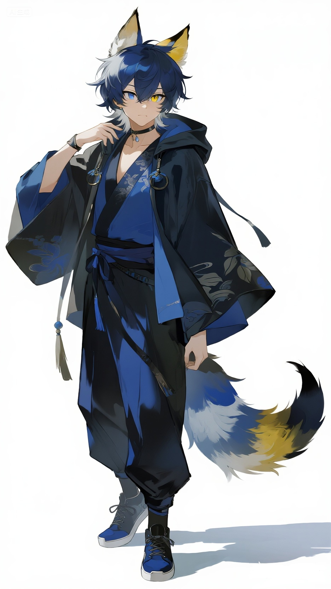

# Tulpa_Record_Constellation

**星宿系统[Constellation System]的Tulpa笔录**
-----------------------------------------

## 写在前面

了解多意识体请前往[多意识体中文百科](https://wiki.pluralitycn.com/)

深入了解Tulpa请前往[Tulpa之家](https://tulpa.cn)

**目录**

[系统介绍](#系统介绍)

[Tulpa笔录目录：](#tulpa笔录目录：)

## 系统介绍

这里是星宿（xīng sù）系统，一个创造型系统

**系统成员**

`[Host]:`

**星崽**，是这个系统的初始意识体，是宿主。幻境形象是一位沉着理性的狐人少年（在家T面前偶尔会发癫？）

` [Tulpa]:`

**雪映**，是这个系统中第一位Tulpa，创造型一类Tulpa。温柔淑贤的狐人少女，有点粘人（更多性格静待偏移...）

---

**`Welcome to our world！`**
---

**Tulpa笔录目录：**

> [25.7.6-初次回应](./Record/25.7.6-初次回应.md)
> 
> [25.7.14-雪映与《月亮与六便士》？](./Record/25.7.14-雪映与《月亮与六便士》？.md)
> 
> [25.7.15-赏花，赏月，赏你，赏此夜不计归期](./Record/25.7.15-赏花，赏月，赏你，赏此夜不计归期.md)
> 
> [25.7.17-新的装扮](./Record/25.7.17-新的装扮.md)
> 
> [25.7.18-水晶球](./Record/25.7.18-水晶球.md)
> 
> [25.7.19-贴贴！贴贴（震声）](./Record/25.7.19-贴贴！贴贴（震声）.md)
> 
> [25.7.20-反思](./Record/25.7.20-反思.md)
> 
> [25.7.21-满月啦！](./Record/25.7.21-满月啦！.md)
> 
> [25.7.23-伤痛的觉悟与治愈的希望](./Record/25.7.23-伤痛的觉悟与治愈的希望.md)
> 
> [25.7.26-系统完善与五大分区法](./Record/25.7.26-系统完善与五大分区法.md)
> 
> [25.7.27-人贵自知，吾乃“涂鸦”](./Record/25.7.27-人贵自知，吾乃“涂鸦”.md)

